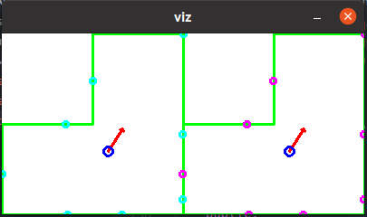

# ESKF-2D-localization
a very simple implementation for ESKF

## Dependencies
* OpenCV3
* Eigen3

## Compile
```bash
mkdir build
cd build
cmake ..
make
```

## Usage
```bash
./eskf_locate
```



* use mouse to drag the car (in left part view).
* long press `Q` or `E` to rotate the car.
* press `Esc` to exit.
